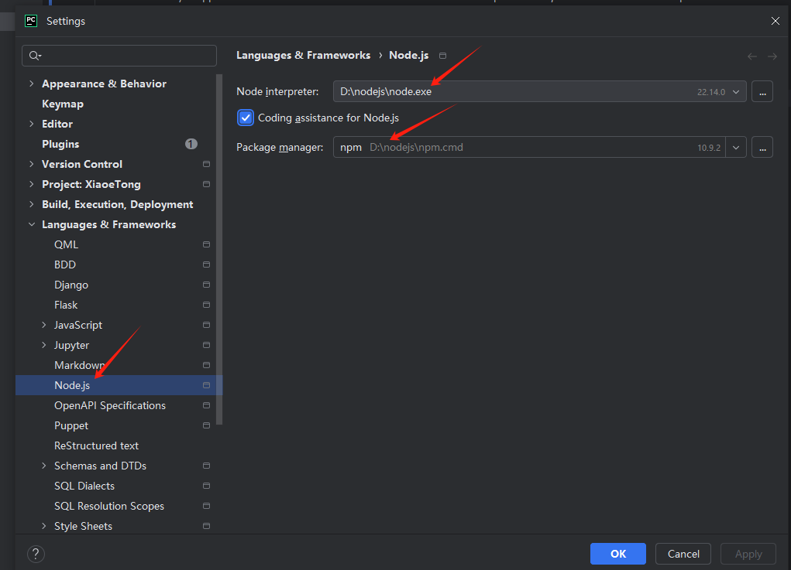

# XiaoeTong Video Download

This tool only supports the download of courses that users have purchased, and does not crack paid courses.
Before using this tool, you need to have a Xiaoetong account and get the login cookie, appid and m3u8 link

# Dependency Installation
pip install -r requirements.txt

# JavaScript environment configuration

## DownLoad JS
https://blog.csdn.net/web13688565871/article/details/146432845

## Pycharm add js

# How to use

Fill in the cookie appid and m3u8 url in the config file
